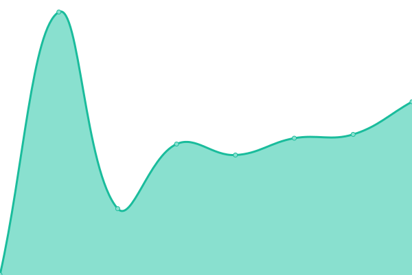

# [📈 Live Status](https://status.wronnay.net): <!--live status--> **🟩 All systems operational**

This repository contains the open-source uptime monitor and status page for [Wronnay](http://wronnay.net/), powered by [Upptime](https://github.com/upptime/upptime).

With [Upptime](https://upptime.js.org), you can get your own unlimited and free uptime monitor and status page, powered entirely by a GitHub repository. We use [Issues](https://github.com/Wronnay/status/issues) as incident reports, [Actions](https://github.com/Wronnay/status/actions) as uptime monitors, and [Pages](https://status.wronnay.net) for the status page.

<!--start: status pages-->
<!-- This summary is generated by Upptime (https://github.com/upptime/upptime) -->
<!-- Do not edit this manually, your changes will be overwritten -->
<!-- prettier-ignore -->
| URL | Status | History | Response Time | Uptime |
| --- | ------ | ------- | ------------- | ------ |
|  [Server](http://s3.wronnay.net) | 🟩 Up | [server.yml](https://github.com/Wronnay/status/commits/HEAD/history/server.yml) | 

 1619ms
     
 | 

<a href="https://status.wronnay.net/history/server">100.00%</a>
    

|  [Blog](https://blog.wronnay.net) | 🟩 Up | [blog.yml](https://github.com/Wronnay/status/commits/HEAD/history/blog.yml) | 

 74ms
     
 | 

<a href="https://status.wronnay.net/history/blog">100.00%</a>
    

|  [Kanboard](https://kb.wronnay.net) | 🟩 Up | [kanboard.yml](https://github.com/Wronnay/status/commits/HEAD/history/kanboard.yml) | 

 947ms
     
 | 

<a href="https://status.wronnay.net/history/kanboard">100.00%</a>
    

|  [Gitea](https://git.kernel.fun/) | 🟩 Up | [gitea.yml](https://github.com/Wronnay/status/commits/HEAD/history/gitea.yml) | 

 923ms
     
 | 

<a href="https://status.wronnay.net/history/gitea">100.00%</a>
    

|  [WebPage4.Me](https://webpage4.me) | 🟩 Up | [web-page4-me.yml](https://github.com/Wronnay/status/commits/HEAD/history/web-page4-me.yml) | 

 1092ms
     
 | 

<a href="https://status.wronnay.net/history/web-page4-me">100.00%</a>
    

<!--end: status pages-->

[**Visit our status website →**](https://status.wronnay.net)

## 📄 License

- Powered by: [Upptime](https://github.com/upptime/upptime)
- Code: [MIT](./LICENSE) © [Wronnay](http://wronnay.net/)
- Data in the `./history` directory: [Open Database License](https://opendatacommons.org/licenses/odbl/1-0/)
